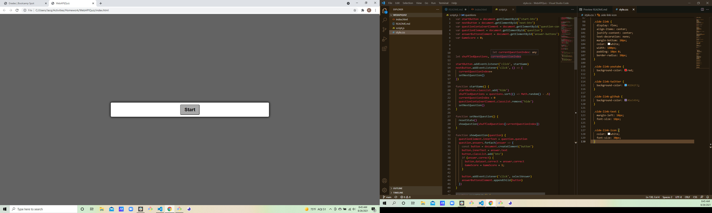

# #Web API Quiz

[Link to Quiz](<a href="C:\Users\Jacq\Activities\Homework\WebAPIQuiz\index.html">)

## Table of Contents
- [index.html](Contains-the-html-document-for-the-quiz.)
- [script.js](Contains-the-javascript-file-for-the-quiz.)
- [style.css](Contains-the-stylesheet-for-the-quiz.)
- [screenshot6.png](Contains-a-screenshot-image-of-the-quiz-and-the-code-for-the-quiz.)

## Desciption
A code quiz that on clicking start, you are presented with a timer to answer questions and time is deducted or increased upon answering wrong or right. At the end of the game there is a scoreboard.

## Screenshots

## Usage
Use this quiz by opening in browser.

## License
None

## Badges
None